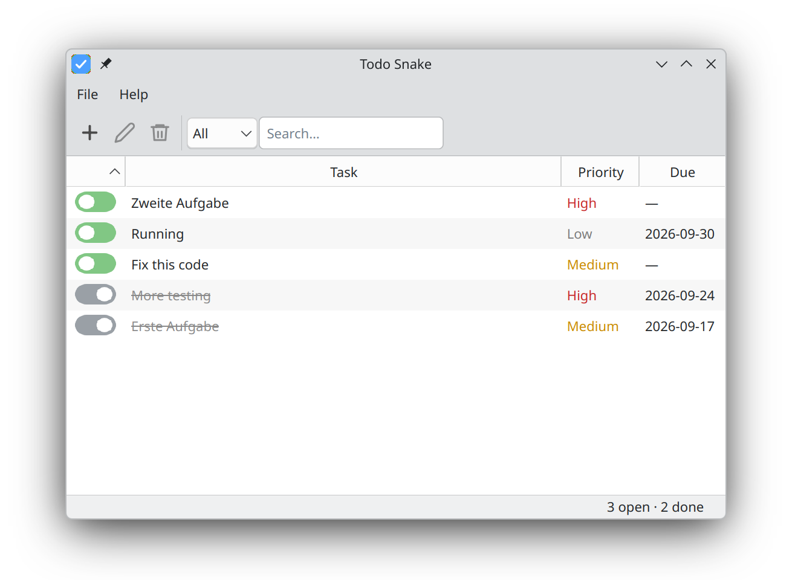

# Todo Snake


A clean PySide6 TODO app with system tray integration. Tasks are stored in a
local SQLite database, and the app hides to the system tray instead of exiting
when the window is closed.

## Features

- Add, edit, delete and mark tasks done (double-click to edit)
- Filter by status, full-text search, priorities and due dates
- Import / export as JSON
- System tray with notifications ("All done!")
- Single-instance enforcement
- Translatable UI (German included; follows the system locale, override with `TODO_SNAKE_LANG`)
- XDG-compliant data directory



## Install

User-level XDG install (recommended, no root):

```sh
./install.sh
```

Launch from the application menu, or run:

```sh
~/.local/share/todo-snake/venv/bin/todo-snake
```

Other options (system-wide, repo-local venv, manual pip) and uninstall
instructions: [docs/INSTALL.md](docs/INSTALL.md).

## Requirements

Python 3.10+ on Linux with a Qt platform (X11 or Wayland).

## Development

Setup, running the tests and project structure:
[docs/DEVELOPMENT.md](docs/DEVELOPMENT.md). To run from source:

```sh
python main.py
```

## License

[LICENSE](LICENSE)