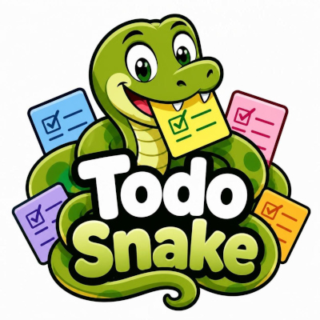
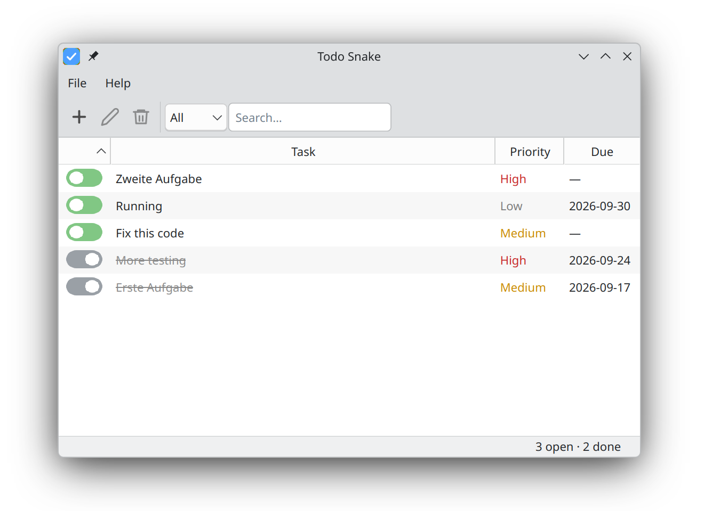

# Todo Snake



A clean PySide6 TODO app with system tray integration. Tasks are stored in a
local SQLite database, and the app hides to the system tray instead of exiting
when the window is closed.

## Features

- Add, edit, delete and mark tasks done (double-click to edit)
- Status (**open / in progress / done**), an optional **start date**, **all-day**
  due dates and a per-task **reminder lead time**
- Recurring tasks (daily / weekly / monthly / yearly), shown with an ∞ in the
  list; completing one advances it to the next occurrence
- Due date **and time** per task, with a persistent reminder window (snooze 2/5/10 min) and a blinking tray icon
- Filter by status, full-text search, priorities and due dates
- **Attachments**: files per task, stored locally and opened with one click
  (uploaded to Nextcloud Files when a Nextcloud account is set up). A **Files**
  column marks tasks with attachments; the list shows image previews and
  type icons.
- Import / export as JSON
- Optional cloud sync via WebDAV or CalDAV (see [Sync](#sync))
- System tray with notifications ("All done!")
- Single-instance enforcement
- Translatable UI (German included; follows the system locale, override with `TODO_SNAKE_LANG`)
- XDG-compliant data directory



## Sync

Tasks can sync to your own cloud — no account with a third party is required.

- **Nextcloud (Tasks)** — syncs with the **Nextcloud Tasks app**: every task is
  a `VTODO` in the task calendar you choose. Use *Connect to Nextcloud…* in the
  account dialog: paste the **full calendar URL** (e.g.
  `https://cloud.example.com/apps/tasks/calendars/tasks`) and sign in via Login
  Flow v2 (SSO and 2FA included) — one field is enough; a calendar that does not
  exist yet is created on the first sync. No shell access needed.
- **CalDAV** — sync against any other CalDAV server: Baïkal (sabre/dav),
  Radicale, fruux or Vikunja. Paste the full calendar collection URL, e.g.
  `https://cloud.example.com/remote.php/dav/calendars/alice/tasks/`.
- **WebDAV (generic)** — keep the sync state as a JSON document on any plain
  WebDAV server: rclone (`rclone serve webdav`), Apache `mod_dav`, ownCloud, …

Configure accounts under *Settings → Sync accounts*. Credentials are sent as
HTTP Basic over TLS (plain `http://` is only allowed for localhost). Conflicts
are resolved per task with last-write-wins; deletions propagate as tombstones.
Each account has a checkbox in the list: uncheck it to **disable** the account
without deleting it (a disabled account is skipped by every sync, manual
included).

Attachment files live in Nextcloud under *Files → Todo Snake/Attachments/*.
Removing an attachment deletes its file on the next sync, and every sync also
**sweeps the task folders** for files nothing references any more (so leftovers
from earlier versions disappear on their own). *Clean up orphaned files…* does
the same for the whole folder on demand, after a confirmation.

Trigger a sync anytime with the **Sync now** button in the toolbar (disabled
while no account is enabled), or turn on periodic sync under
*Settings → Sync behavior*.

## Install

User-level XDG install (recommended, no root):

```sh
./install.sh
```

Launch from the application menu, or run:

```sh
~/.local/share/todo-snake/venv/bin/todo-snake
```

Other options (system-wide, repo-local venv, manual pip) and uninstall
instructions: [docs/INSTALL.md](docs/INSTALL.md).

## Requirements

Python 3.10+ on Linux with a Qt platform (X11 or Wayland), and
[PySide6](https://pypi.org/project/PySide6/) 6.11.2 (Qt 6.11) or newer within
6.11. Everything else is the standard library — the sync does not pull in any
HTTP or iCalendar dependency.

## Development

Setup, running the tests and project structure:
[docs/DEVELOPMENT.md](docs/DEVELOPMENT.md). To run from source:

```sh
python main.py
```

## License

[LICENSE](LICENSE)